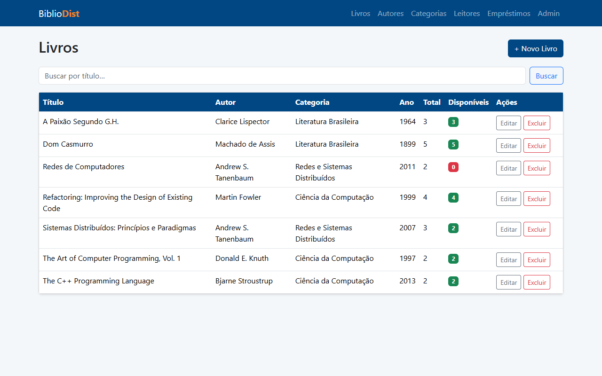
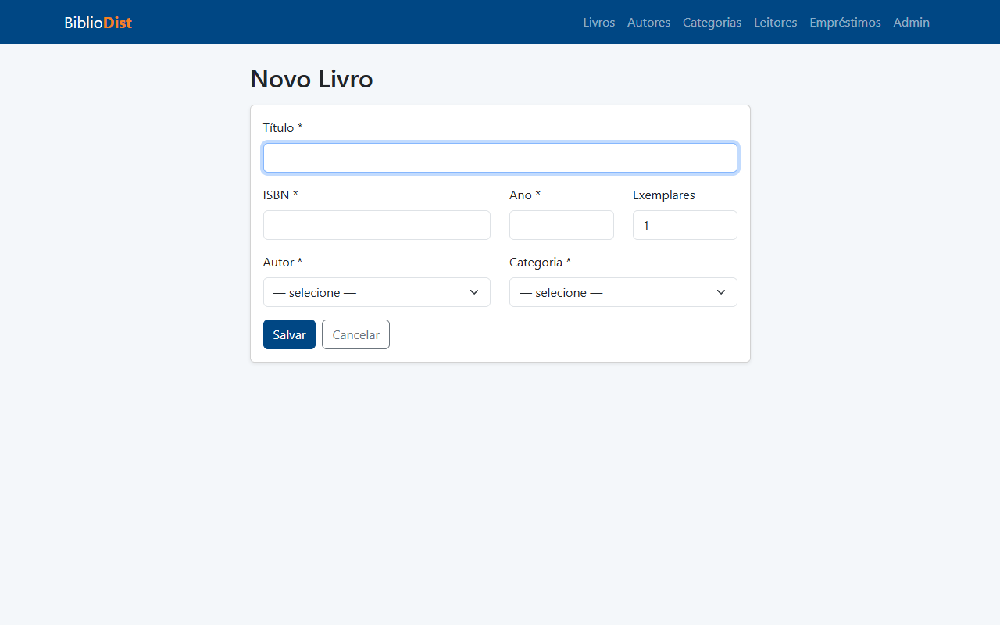
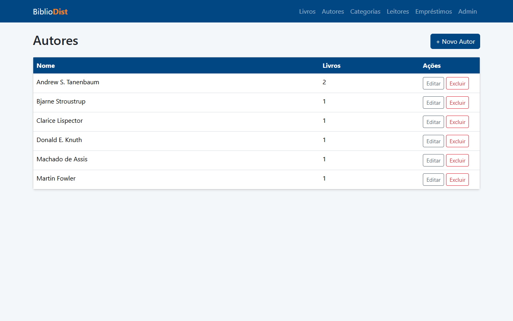
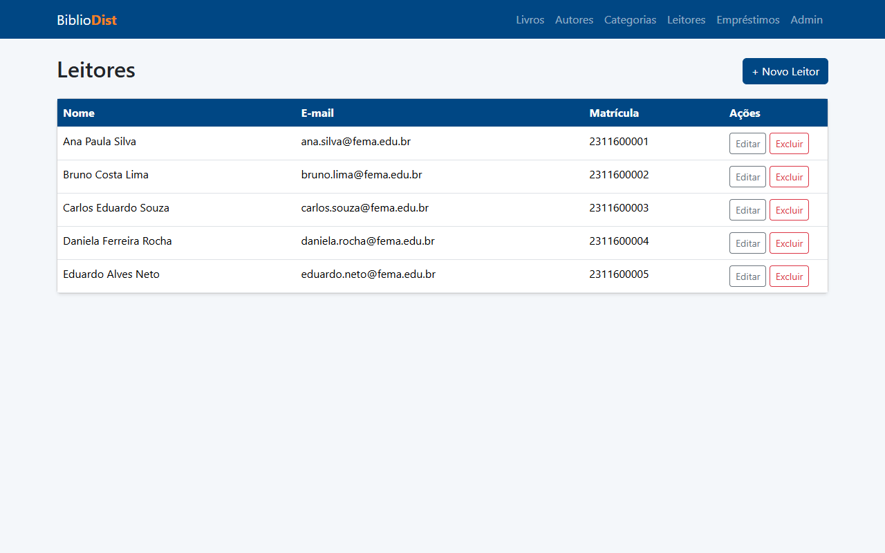
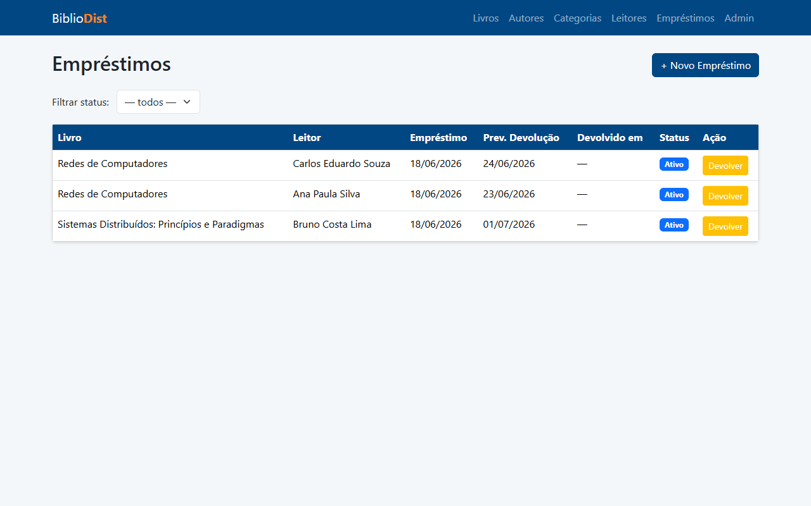
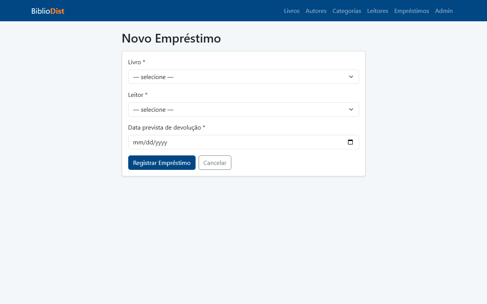
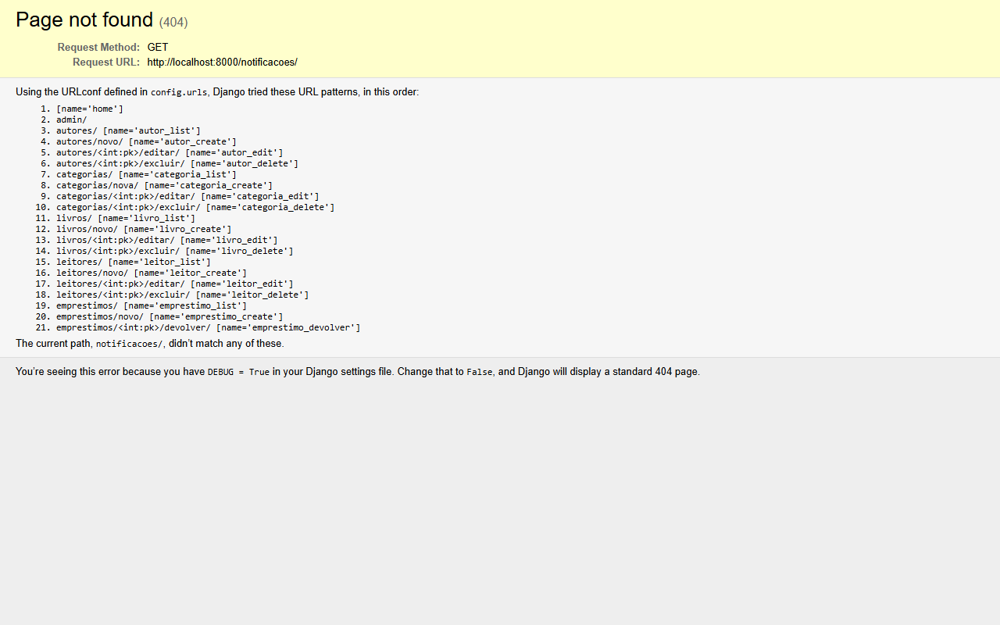
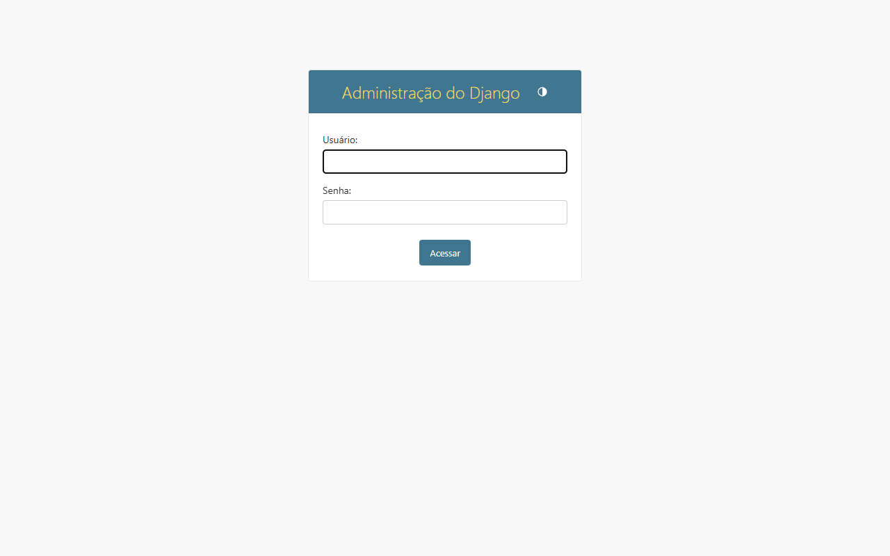

# BiblioDist — Sistema de Gerenciamento de Biblioteca Distribuída

**Disciplina:** Sistemas Distribuídos  
**Professor:** Almir  
**Instituição:** FEMA — Fundação Educacional do Município de Assis  
**Aluno:** Arthur Naoto Miura  
**RA:** 2311600029  
**Data:** Junho de 2026  

---

## Sumário

1. [Objetivo e Contexto](#1-objetivo-e-contexto)  
2. [Arquitetura do Sistema](#2-arquitetura-do-sistema)  
3. [Tecnologias e Bibliotecas Utilizadas](#3-tecnologias-e-bibliotecas-utilizadas)  
4. [Fase 0 — Setup Inicial](#4-fase-0--setup-inicial)  
5. [Fase 1 — Domínio da Biblioteca](#5-fase-1--domínio-da-biblioteca)  
6. [Fase 2 — Serviço gRPC](#6-fase-2--serviço-grpc)  
7. [Fase 3 — Mensageria com RabbitMQ](#7-fase-3--mensageria-com-rabbitmq)  
8. [Fase 4 — Containerização com Docker](#8-fase-4--containerização-com-docker)  
9. [Como Executar o Sistema](#9-como-executar-o-sistema)  
10. [Telas do Sistema](#10-telas-do-sistema)  
11. [Conclusão e Aprendizados](#11-conclusão-e-aprendizados)  

---

## 1. Objetivo e Contexto

O projeto **BiblioDist** foi desenvolvido como trabalho prático da disciplina de Sistemas Distribuídos. O objetivo é construir um sistema de gerenciamento de biblioteca que demonstre na prática os três principais paradigmas de comunicação distribuída:

- **HTTP/REST** — comunicação síncrona entre cliente e servidor web  
- **RPC com gRPC** — chamada remota de procedimento entre microsserviços  
- **Mensageria assíncrona com RabbitMQ** — desacoplamento via filas de mensagens  

O sistema gerencia livros, autores, categorias, leitores, empréstimos e notificações, integrando esses três mecanismos em um fluxo coeso.

---

## 2. Arquitetura do Sistema

```
┌─────────────────────────────────────────────────────────────┐
│                        Usuário (Browser)                    │
└─────────────────────────┬───────────────────────────────────┘
                          │ HTTP (porta 8000)
┌─────────────────────────▼───────────────────────────────────┐
│              api-web (Django + Gunicorn)                    │
│   CRUD Livros │ Autores │ Leitores │ Empréstimos            │
└──────────┬────────────────────────────────┬─────────────────┘
           │ gRPC (porta 50051)             │ AMQP (porta 5672)
┌──────────▼──────────┐        ┌────────────▼────────────────┐
│  grpc-service       │        │        RabbitMQ             │
│  BibliotecaService  │        │   fila: notificacoes        │
│  VerificarDisp.     │        └────────────┬────────────────┘
│  RegistrarEmp.      │                     │ consume
└──────────┬──────────┘        ┌────────────▼────────────────┐
           │ Django ORM        │          worker             │
           │                   │  persiste Notificacao no DB │
┌──────────▼───────────────────▼─────────────────────────────┐
│                  PostgreSQL (porta 5432)                    │
└─────────────────────────────────────────────────────────────┘
```

### Fluxo de um Empréstimo

1. Usuário preenche o formulário em `/emprestimos/novo/`
2. Django (api-web) chama **gRPC** → `VerificarDisponibilidade(livro_id)`
3. Se disponível, chama **gRPC** → `RegistrarEmprestimo(livro_id, leitor_id, data_prevista)`
4. O servidor gRPC cria o registro no banco e publica na **fila RabbitMQ**
5. O **worker** consome a mensagem e persiste a `Notificacao` no banco
6. Usuário vê a confirmação na tela

> Se o gRPC estiver offline: Django cria o empréstimo localmente (fallback) e publica na fila diretamente.  
> Se o RabbitMQ estiver offline: a notificação é criada diretamente no banco (fallback síncrono).

---

## 3. Tecnologias e Bibliotecas Utilizadas

### Linguagem

| Tecnologia | Versão | Uso |
|---|---|---|
| Python | 3.12 | Linguagem principal de todos os serviços |
| JavaScript | Node 24 | Geração de screenshots (puppeteer) |

### Backend

| Biblioteca | Versão | Finalidade |
|---|---|---|
| **Django** | 5.0 | Framework web MVC — views, models, templates, admin, ORM |
| **Gunicorn** | 26.0 | Servidor WSGI de produção (substitui o `runserver`) |
| **dj-database-url** | 2.1 | Leitura da `DATABASE_URL` para configurar o banco |
| **python-dotenv** | 1.0 | Carregamento de variáveis de ambiente do `.env` |
| **whitenoise** | 6.6 | Servir arquivos estáticos diretamente pelo Django |

### Banco de Dados

| Biblioteca | Versão | Finalidade |
|---|---|---|
| **PostgreSQL** | 16 | Banco de dados relacional (produção/Docker) |
| **psycopg2-binary** | 2.9 | Driver Python para conexão com PostgreSQL |
| SQLite | — | Banco de dados local para desenvolvimento sem Docker |

### gRPC

| Biblioteca | Versão | Finalidade |
|---|---|---|
| **grpcio** | 1.60 | Runtime gRPC — servidor e cliente |
| **grpcio-tools** | 1.60 | Compilador de `.proto` → stubs Python |
| **protobuf** | 4.21 | Serialização de mensagens Protocol Buffers |

### Mensageria

| Biblioteca | Versão | Finalidade |
|---|---|---|
| **RabbitMQ** | 3.13 | Broker de mensagens AMQP |
| **pika** | 1.3 | Cliente Python para RabbitMQ |

### Containerização

| Tecnologia | Versão | Finalidade |
|---|---|---|
| **Docker** | — | Containerização de cada serviço |
| **Docker Compose** | — | Orquestração dos 6 containers |

### Técnicas Utilizadas

| Técnica | Descrição |
|---|---|
| **MVC (Model-View-Controller)** | Organização do Django em models, views e templates |
| **ORM** | Acesso ao banco via Django ORM — sem SQL manual |
| **RPC síncrono** | gRPC com Protocol Buffers para comunicação entre serviços |
| **Filas de mensagens** | RabbitMQ AMQP com fila durável `notificacoes` |
| **Padrão Fallback** | Degradação graciosa quando gRPC ou MQ estão offline |
| **Health Check** | `pg_isready` e `rabbitmq-diagnostics ping` no Docker |
| **Init container** | Serviço `migrate` garante schema antes dos outros subirem |
| **Variáveis de ambiente** | Toda configuração via env vars — sem segredos no código |

---

## 4. Fase 0 — Setup Inicial

**Commit:** `feat: setup inicial do projeto`

Criação do esqueleto do projeto Django com as melhores práticas para deploy:

```
bibliodist/
├── api-web/
│   ├── config/
│   │   ├── settings.py   # configuração via env vars
│   │   ├── urls.py
│   │   └── wsgi.py
│   ├── manage.py
│   ├── Procfile          # para deploy no Railway
│   ├── runtime.txt       # python-3.12
│   └── requirements.txt
├── grpc-service/
├── proto/
└── worker/
```

**Decisões de design:**
- `SECRET_KEY`, `DATABASE_URL`, `ALLOWED_HOSTS` via variáveis de ambiente
- Fallback para SQLite quando `DATABASE_URL` não está definida
- WhiteNoise para servir arquivos estáticos sem Nginx

---

## 5. Fase 1 — Domínio da Biblioteca

**Commits:** `feat: dominio da biblioteca` + `fix: mensagem de erro destacada`

### Models

```python
# api-web/biblioteca/models.py (trechos principais)

class Livro(models.Model):
    titulo = models.CharField(max_length=300)
    isbn = models.CharField(max_length=20, unique=True)
    autor = models.ForeignKey(Autor, on_delete=models.PROTECT)
    total_exemplares = models.PositiveIntegerField(default=1)

    @property
    def exemplares_disponiveis(self):
        ativos = self.emprestimos.filter(status="ativo").count()
        return self.total_exemplares - ativos


class Emprestimo(models.Model):
    STATUS_CHOICES = [("ativo","Ativo"), ("devolvido","Devolvido"), ("atrasado","Atrasado")]
    livro = models.ForeignKey(Livro, on_delete=models.PROTECT)
    leitor = models.ForeignKey(Leitor, on_delete=models.PROTECT)
    data_emprestimo = models.DateField(default=timezone.now)
    data_prevista = models.DateField()
    status = models.CharField(max_length=10, choices=STATUS_CHOICES)


class Notificacao(models.Model):
    leitor = models.ForeignKey(Leitor, on_delete=models.CASCADE)
    emprestimo = models.ForeignKey(Emprestimo, on_delete=models.CASCADE)
    tipo = models.CharField(max_length=15)  # emprestimo | devolucao | atraso
    mensagem = models.TextField()
    criada_em = models.DateTimeField(auto_now_add=True)
```

### Funcionalidades

- CRUD completo para Livros, Autores, Categorias e Leitores
- Busca por título nos livros; paginação de 10 itens por página
- Empréstimos: criar (bloqueia se sem exemplares disponíveis), listar, devolver
- Detecção automática de atraso: atualiza status ao abrir a lista de empréstimos
- `python manage.py seed [--limpar]` para popular o banco com dados de teste
- Admin Django registrado para todos os models

---

## 6. Fase 2 — Serviço gRPC

**Commit:** `feat: servico gRPC (BibliotecaService) com cliente integrado no Django`

### Definição do contrato (biblioteca.proto)

```protobuf
syntax = "proto3";
package biblioteca;

service BibliotecaService {
  rpc VerificarDisponibilidade(VerificarRequest) returns (DisponibilidadeResponse);
  rpc RegistrarEmprestimo(EmprestimoRequest) returns (EmprestimoResponse);
}

message VerificarRequest  { int32 livro_id = 1; }
message DisponibilidadeResponse {
  bool   disponivel             = 1;
  int32  exemplares_disponiveis = 2;
  string titulo                 = 3;
}
message EmprestimoRequest {
  int32  livro_id      = 1;
  int32  leitor_id     = 2;
  string data_prevista = 3;
}
message EmprestimoResponse {
  bool   sucesso       = 1;
  int32  emprestimo_id = 2;
  string mensagem      = 3;
}
```

### Geração dos stubs

```bash
python -m grpc_tools.protoc \
  -I proto \
  --python_out=grpc-service \
  --grpc_python_out=grpc-service \
  proto/biblioteca.proto
```

### Cliente no Django (grpc_client.py)

```python
GRPC_HOST = os.environ.get("GRPC_HOST", "localhost")
GRPC_PORT = os.environ.get("GRPC_PORT", "50051")

def verificar_disponibilidade(livro_id: int) -> dict:
    try:
        stub = _get_stub()
        resp = stub.VerificarDisponibilidade(
            biblioteca_pb2.VerificarRequest(livro_id=livro_id), timeout=5
        )
        return {"disponivel": resp.disponivel, ...}
    except grpc.RpcError as exc:
        raise ConnectionError(f"gRPC indisponível: {exc.details()}")
```

**Fallback:** se o gRPC estiver offline, a view captura o `ConnectionError` e cria o empréstimo localmente, exibindo aviso ao usuário.

---

## 7. Fase 3 — Mensageria com RabbitMQ

**Commit:** `feat: mensageria RabbitMQ (mq_publisher + worker de notificacoes)`

### Publicador (mq_publisher.py)

```python
def publicar_emprestimo(emprestimo_id, livro_titulo, leitor_id, data_prevista):
    payload = {
        "tipo": "emprestimo",
        "emprestimo_id": emprestimo_id,
        "leitor_id": leitor_id,
        "mensagem": f'Empréstimo do livro "{livro_titulo}". Devolver até {data_prevista}.',
    }
    try:
        _publicar(payload)   # abre conexão AMQP, publica, fecha
    except Exception:
        _fallback_sincrono(payload)  # cria Notificacao direto no banco
```

### Worker (worker/worker.py)

```python
def processar(ch, method, properties, body):
    payload = json.loads(body)
    Notificacao.objects.create(
        leitor_id=payload["leitor_id"],
        emprestimo_id=payload["emprestimo_id"],
        tipo=payload["tipo"],
        mensagem=payload["mensagem"],
    )
    ch.basic_ack(delivery_tag=method.delivery_tag)

def main():
    while True:   # reconexão automática
        try:
            conectar_e_consumir()
        except pika.exceptions.AMQPConnectionError:
            time.sleep(5)
```

**Características:**
- Fila `notificacoes` durável (`durable=True`) — mensagens persistem se o broker reiniciar
- Mensagens persistentes (`delivery_mode=2`)
- `prefetch_count=1` — worker processa uma mensagem por vez
- Reconexão automática a cada 5 segundos

---

## 8. Fase 4 — Containerização com Docker

**Commit:** `feat: orquestracao Docker (Fase 4)`

### Estrutura dos containers

```yaml
# docker-compose.yml — resumo
services:
  db:        # postgres:16-alpine — banco de dados
  rabbitmq:  # rabbitmq:3.13-management-alpine — broker
  migrate:   # mesmo build do web — roda migrate e sai (init container)
  web:       # Django + Gunicorn — porta 8000
  grpc:      # servidor gRPC — porta 50051
  worker:    # consumidor RabbitMQ
```

### Estratégia de inicialização

O maior desafio foi garantir a ordem correta de inicialização:

```
db (healthy) ──┐
               ├──► migrate (roda e sai) ──► web, grpc, worker
rabbitmq (healthy) ─┘
```

Usando `depends_on` com condições:
```yaml
web:
  depends_on:
    db:
      condition: service_healthy
    rabbitmq:
      condition: service_healthy
    migrate:
      condition: service_completed_successfully
```

### Dockerfiles

Cada serviço tem seu próprio Dockerfile. O ponto importante é que `grpc-service` e `worker` precisam de acesso ao código Django (para usar o ORM), então cada um recebe uma cópia:

```dockerfile
# grpc-service/Dockerfile
WORKDIR /app/grpc-service
COPY grpc-service/ .
COPY api-web/ /app/api-web/   # necessário: server.py usa Path(__file__).parent.parent / "api-web"
```

### Problemas encontrados e soluções

| Problema | Causa | Solução |
|---|---|---|
| `ModuleNotFoundError: No module named 'google'` | `protobuf` não declarado explicitamente | Adicionado `protobuf>=4.21` ao `requirements.txt` |
| Worker falha ao subir | RabbitMQ ainda inicializando (demora ~30s) | Worker tem loop de reconexão automática |
| Dados duplicados no seed | Seed rodado mais de uma vez | `python manage.py seed --limpar` |

---

## 9. Como Executar o Sistema

### Pré-requisitos

- Docker Desktop instalado e rodando
- Git

### Passo a passo

```bash
# 1. Clonar o repositório
git clone <url-do-repositorio>
cd bibliodist

# 2. Subir todos os containers
docker compose up --build

# Aguardar as mensagens (em ordem):
# ✓ database system is ready to accept connections
# ✓ Running migrations: ... OK
# ✓ Server startup complete (RabbitMQ)
# ✓ Booting worker with pid (Gunicorn)
# ✓ Worker conectado. Aguardando mensagens na fila 'notificacoes'

# 3. Popular o banco com dados de teste (somente no primeiro uso)
docker compose exec web python manage.py seed

# 4. Criar usuário admin (opcional)
docker compose exec web python manage.py createsuperuser
```

### Acessos

| Serviço | URL | Credenciais |
|---|---|---|
| Aplicação web | http://localhost:8000 | — |
| Admin Django | http://localhost:8000/admin | usuário criado no passo 4 |
| RabbitMQ UI | http://localhost:15672 | guest / guest |

### Comandos úteis

```bash
# Ver logs de um serviço específico
docker compose logs web
docker compose logs grpc
docker compose logs worker

# Ver todos os containers e seus status
docker compose ps

# Parar tudo (mantém o banco de dados)
docker compose down

# Parar tudo E apagar o banco (recomeçar do zero)
docker compose down -v
```

### Execução sem Docker (desenvolvimento local)

```bash
# Terminal 1 — servidor gRPC
cd grpc-service
pip install -r requirements.txt
python server.py

# Terminal 2 — aplicação Django
cd api-web
pip install -r requirements.txt
python manage.py migrate
python manage.py seed
python manage.py runserver

# Terminal 3 — worker RabbitMQ
cd worker
pip install -r requirements.txt
python worker.py

# Pré-requisito: RabbitMQ rodando localmente (localhost:5672, guest/guest)
```

---

## 10. Telas do Sistema

### Lista de Livros



*Tela principal do catálogo de livros. Exibe título, autor, categoria, ano, total de exemplares e exemplares disponíveis em tempo real. Conta com busca por título e paginação de 10 itens.*

---

### Cadastro de Livro



*Formulário de cadastro de novo livro. Campos: título, ISBN, ano, autor, categoria e total de exemplares.*

---

### Lista de Autores



*Gerenciamento de autores com opções de editar e excluir.*

---

### Lista de Leitores



*Cadastro de leitores com nome, e-mail e matrícula.*

---

### Lista de Empréstimos



*Lista de empréstimos com status (ativo, devolvido, atrasado). A detecção de atraso é automática: ao abrir a tela, o sistema verifica todos os empréstimos ativos com data vencida e atualiza o status.*

---

### Novo Empréstimo



*Formulário de novo empréstimo. Livros sem exemplares disponíveis aparecem desabilitados no select. Ao submeter, o Django chama o serviço gRPC para verificar disponibilidade e registrar o empréstimo.*

---

### Notificações



*Notificações geradas automaticamente pelo worker RabbitMQ. Cada empréstimo e devolução gera uma mensagem na fila que o worker consome e persiste como Notificacao no banco.*

---

### Painel Admin Django



*Interface administrativa do Django. Permite gerenciar todos os models diretamente, útil para inspecionar dados durante o desenvolvimento.*

---

### Painel RabbitMQ


*Painel de gerenciamento do RabbitMQ (http://localhost:15672). Mostra a fila `notificacoes`, conexões ativas e estatísticas de mensagens publicadas/consumidas.*

---

## 11. Conclusão e Aprendizados

O projeto BiblioDist demonstrou na prática a integração dos três paradigmas de comunicação distribuída mais utilizados na indústria:

### O que foi implementado

- **Sistema web completo** com Django, cobrindo o ciclo inteiro de uma biblioteca: livros, autores, categorias, leitores, empréstimos e notificações
- **gRPC** como camada de serviço interno: o contrato é definido em `.proto`, os stubs são gerados automaticamente, e a comunicação é tipada e eficiente (Protocol Buffers vs JSON)
- **RabbitMQ** para desacoplamento assíncrono: o Django não precisa esperar a notificação ser processada — ele publica na fila e continua. O worker processa no seu próprio ritmo
- **Docker Compose** orquestrando 6 serviços: banco, broker, init container de migrations, e os três serviços da aplicação

### Desafios técnicos

1. **Ordem de inicialização dos containers** — resolvido com healthchecks e a condição `service_completed_successfully` no serviço `migrate`
2. **Namespace `google.protobuf`** — o `grpcio` depende do `protobuf`, mas é necessário declará-lo explicitamente no `requirements.txt` para garantir que o namespace esteja disponível no container
3. **Bootstrap do Django ORM** nos serviços `grpc-service` e `worker` — ambos precisam do código de `api-web` para acessar os models. Resolvido copiando `api-web/` para o container com o path relativo correto
4. **Fallbacks** — tanto o gRPC quanto o RabbitMQ têm fallback gracioso, garantindo que o sistema continue funcionando mesmo com falhas parciais

### Aprendizados

- **gRPC vs REST**: gRPC é mais eficiente para comunicação interna entre serviços (binário, tipado, streaming), enquanto REST/HTTP é mais adequado para APIs públicas
- **Mensageria assíncrona**: o desacoplamento via fila permite que o serviço produtor e consumidor evoluam independentemente e toleram falhas um do outro
- **Containerização**: Docker Compose simplifica enormemente a orquestração de múltiplos serviços, reproduzindo em qualquer máquina o mesmo ambiente de execução
- **Padrão de init container**: separar a migração do banco em um container dedicado é uma prática essencial para evitar condições de corrida na inicialização

---

*Relatório gerado como parte da avaliação da disciplina de Sistemas Distribuídos — FEMA, 2026.*
